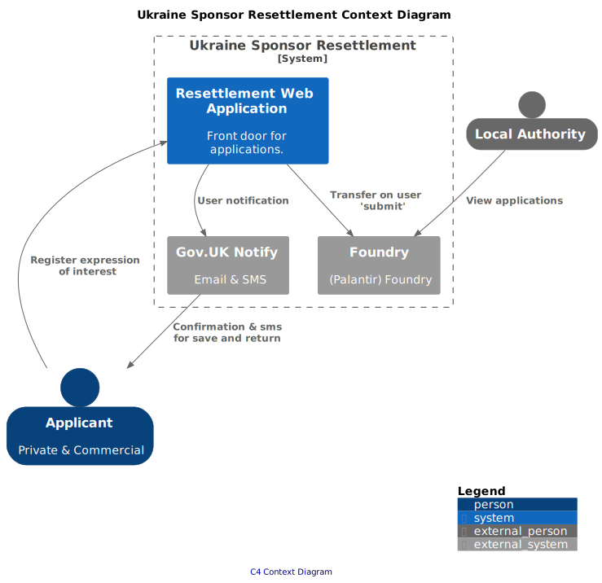

# Ukraine Sponsor Resettlement

This is the codebase for the [Ruby on Rails app](https://apply-to-offer-homes-for-ukraine.service.gov.uk/) that will handles the submission of sponsorship requests.

## Context Diagram

The, [C4 system context diagram](https://c4model.com/#SystemContextDiagram) is intended to show, at the highest level, the key users and interactions in the system.

## Monitoring

- [sentry.io](https://sentry.io/organizations/dluhc-ulss/projects/dluhc-ulss/?project=6260319)
- [logit.io Dashboard](https://dashboard.logit.io/a/6b6785a5-cb7f-4d9b-a456-456949f5aa07)
- [Grafana Production Dashboard](https://ukraine-sponsor-resettlement-monitoring-grafana.london.cloudapps.digital/d/0it5-vEnk/production)

### Alerting

Alerts are configured in [Grafana](https://ukraine-sponsor-resettlement-monitoring-grafana.london.cloudapps.digital/d/0it5-vEnk/production) and push to the following destinations:

- __#homes-for-ukraine-alerts__, [DLUHC](https://www.gov.uk/government/organisations/department-for-levelling-up-housing-and-communities) managed Slack channel
- [PagerDuty](https://madetech.eu.pagerduty.com/), MadeTech managed instance.
- Email to the team. (Find the email address defined in the grafana alerts)

### Related Repositories

- [Prometheus Exporter](https://github.com/communitiesuk/ukraine-sponsor-resettlement-monitoring) repository
- [Gov PAAS Prometheus Exporter](https://github.com/alphagov/paas-prometheus-exporter), documents the [metrics](https://github.com/alphagov/paas-prometheus-exporter#available-application-metrics) available in Grafana.

## Development

### Pre-requisites

- Docker

### Getting started

Run:
`make run`

Alternatively, to run the rails app in the foreground so that you can see its output, run:
`make run-fg`

The Rails server should start on <http://localhost:8080>

### Running tests
Run: `make test`

NB: The container will be destroyed when the tests complete, which means that the coverage report will be lost.

If you want the coverage report, you can keep the container alive by editing
/bin/test.sh to do

`RAILS_ENV=test rake db:prepare && rake db:migrate && rake && tail -f /dev/null`

instead of terminating when the rake task which runs the tests has finished. (`tail -f /dev/null` is a benign way of keeping the container active).

When the tests have completed you can copy the coverage report to your
docker host's local filesystem by doing

`docker cp <container ID or name>:/app/coverage <destination path on host>`

on the host.
For example, to copy to the coverage report to the current working directory on the host:

`docker cp ukraine-sponsor-resettlement-test-1:/app/coverage .`

You can then terminate the testing container with ctrl-c.
## Database migrations

Database migrations are required to make changes to the database

`rails generate migration <name of migration>`

This will create a file in the db/migrate folder and this file can be amended to reflect the change required.

## Infrastructure

This application is running on GovUK PaaS (https://www.cloud.service.gov.uk/). To deploy, you need to:

#### Backing services

1. To create the Postgres database:\
   `cf create-service postgres tiny-unencrypted-13 ukraine-sponsor-resettlement-<target environment>-postgres`

Please note: this takes up to about 15 minutes & "tiny-unencrypted-13" is the only size available on the free tier

1. To create the S3 bucket:\
    `cf create-service aws-s3-bucket default ukraine-sponsor-resettlement-<target environment>-s3`

2. Bind the service:\
    `cf bind-service ukraine-sponsor-resettlement-<target environment> ukraine-sponsor-resettlement-<target environment>-s3 -c '{"permissions": "read-write"}'`

3. Restage App:\
    `cf restage ukraine-sponsor-resettlement-<target environment>`

#### Deployments

1. Contact 1password manager to get access to the Ukraine Resettlement vault for deployment credentials

2. Install Cloud Foundry CLI (https://docs.cloudfoundry.org/cf-cli/install-go-cli.html)

3. Login:\
   `cf login -a api.london.cloud.service.gov.uk -u dluhc-ulss-deploy@madetech.com`

4. Set your deployment target environment (test/staging/):\
   `cf target -o dluhc-ukraine-resettlement-sponsorship -s <deployment_target_environment>`

5. Deploy:\
   `cf push ukraine-sponsor-resettlement-<target environment> --strategy rolling`

The deployment will use the manifest file based on convention (e.g. staging_manifest.yml)

6. Post-deployment - check logs:\
   `cf logs ukraine-sponsor-resettlement-<target environment> --recent`

#### Troubleshooting deployments

A failed Github deployment action will occasionally leave a Cloud Foundry
deployment in a broken state. As a result all subsequent Github deployment
actions will also fail with the message\
`Cannot update this process while a deployment is in flight`.

`cf cancel-deployment ukraine-sponsor-resettlement-<target environment>`

#### Querying database

You will need the Conduit plug-in installed\
    `cf install-plugin conduit`

1. Contact 1password manager to get access to the Ukraine Resettlement vault for deployment credentials

2. Install Cloud Foundry CLI (https://docs.cloudfoundry.org/cf-cli/install-go-cli.html)

3. Login:\
   `cf login --sso`

4. Connect to database:\
    `cf conduit ukraine-sponsor-resettlement-<target environment>-postgres -c '{"read_only": true}' -- psql`

    You will now be able to run SQL queries that require a ";" at the end to execute the query - for example:\
    `select count(*) from additional_info;`

5. Disconnect:\
    `exit`
